# 04 — Active Directory con Windows Server 2022


Despliegue de un dominio Active Directory sobre Windows Server 2022 en VMware Workstation. El proyecto incluye la promoción del servidor a controlador de dominio, creación de Unidades Organizativas (OUs) por sede, usuarios y grupos de seguridad por departamento, políticas de grupo (GPOs) aplicadas por OU y un cliente Windows 11 Pro unido al dominio.

---

## Índice

- [Infraestructura](#infraestructura)
- [Dominio](#dominio)
- [Configuración](#configuración)
- [Usuarios y grupos](#usuarios-y-grupos)
- [Políticas de grupo (GPOs)](#políticas-de-grupo-gpos)
- [Verificación](#verificación)
- [Problemas encontrados](#problemas-encontrados)

---

## Infraestructura

| Parámetro | SRV-DC-01 | PC-CLIENT-01 |
|---|---|---|
| SO | Windows Server 2022 Standard Evaluation | Windows 11 Pro x64 |
| RAM | 4 GB | 4 GB |
| Disco | 60 GB NVMe | 60 GB NVMe |
| CPU | 2 núcleos | 2 núcleos |
| Red | LAN Segment 1 + NAT | LAN Segment 1 |
| IP | 192.168.100.1 | 192.168.100.10 |
| Hipervisor | VMware Workstation 17 Player | VMware Workstation 17 Player |

### Configuración de red — SRV-DC-01

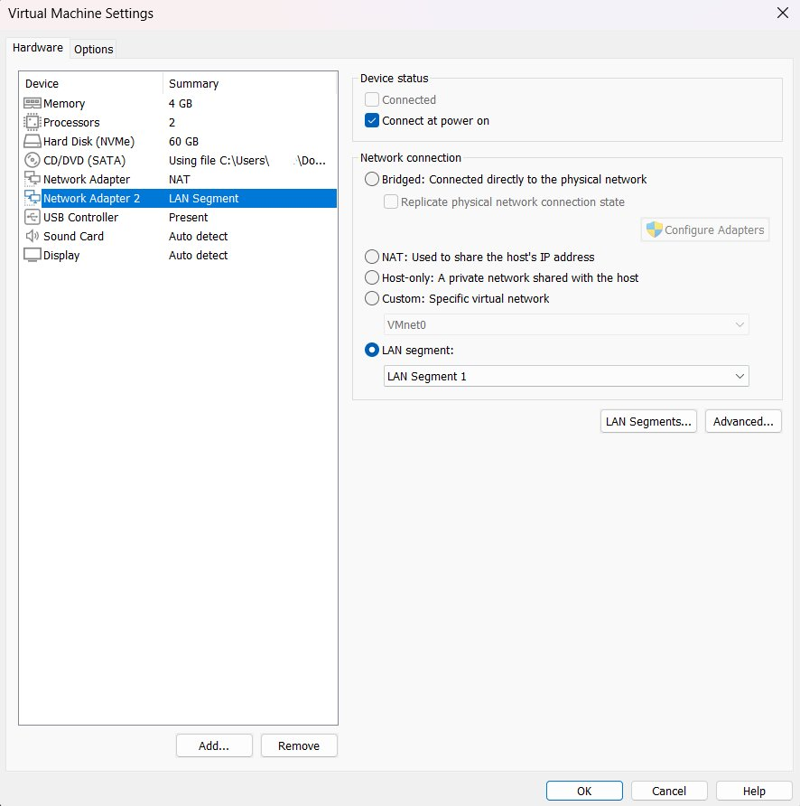
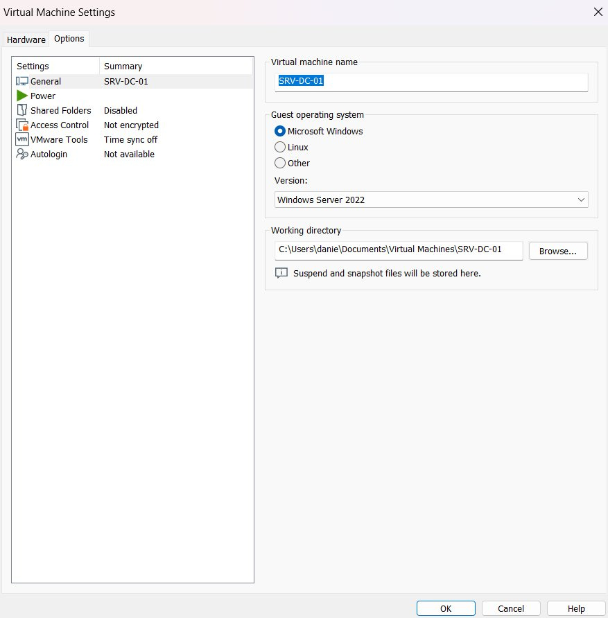

### Configuración de red — PC-CLIENT-01

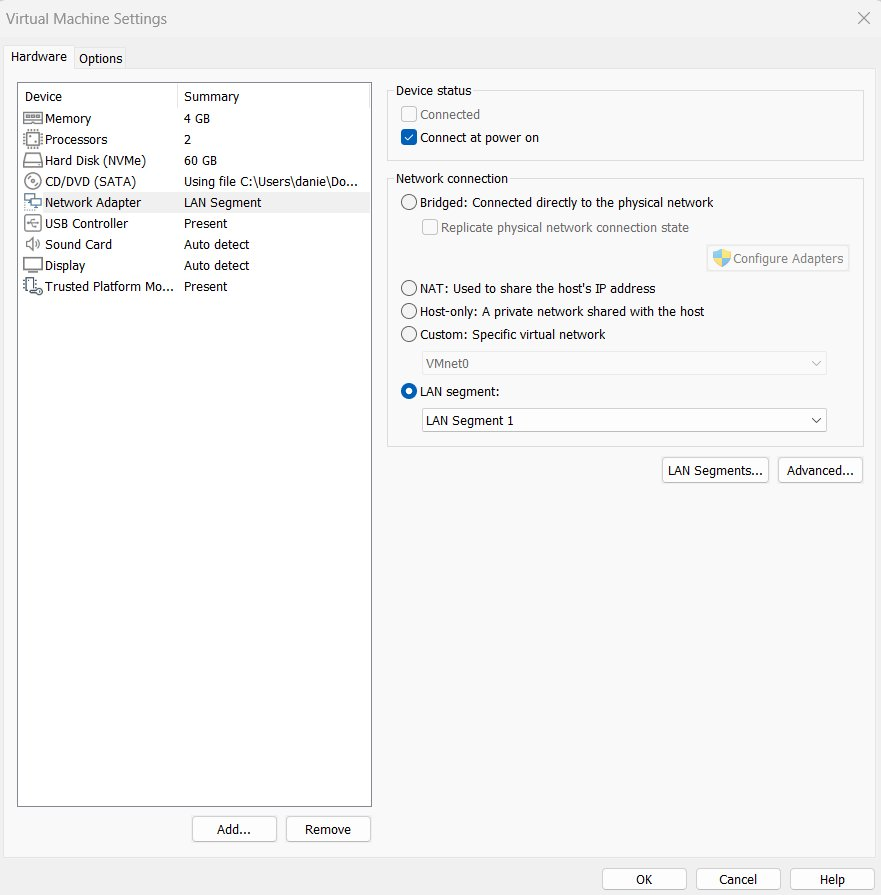
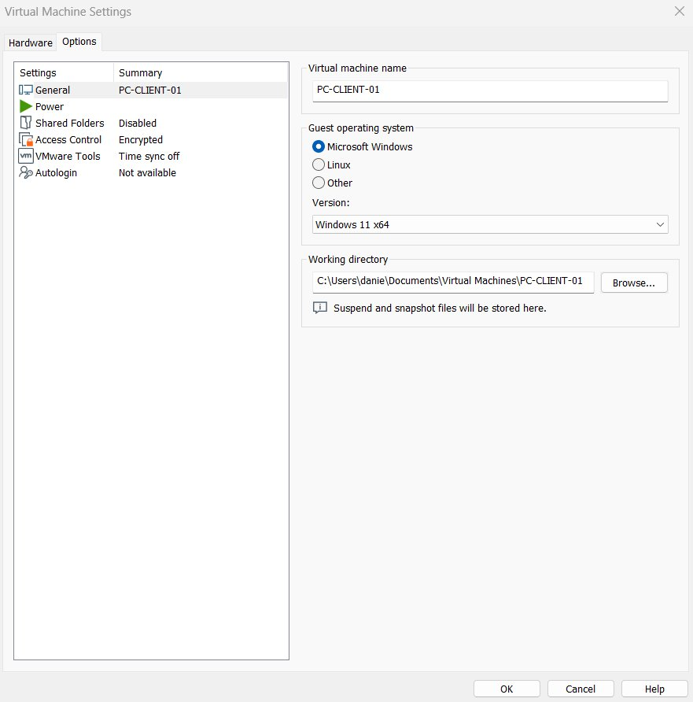

---

## Dominio

| Parámetro | Valor |
|---|---|
| Nombre del dominio | empresa.local |
| Controlador de dominio | SRV-DC-01.empresa.local |
| Nivel funcional del bosque | Windows Server 2016 |
| Nivel funcional del dominio | Windows Server 2016 |
| DNS integrado | Sí — 192.168.100.1 |
| Router-id OSPF | 1.1.1.1 |

---

## Configuración

### 1. IP estática en SRV-DC-01

```
IP:      192.168.100.1
Máscara: 255.255.255.0
Gateway: (vacío)
DNS:     127.0.0.1
```

### 2. Instalación de AD DS y promoción a controlador de dominio

```powershell
# Instalación del rol desde PowerShell
Install-WindowsFeature -Name AD-Domain-Services -IncludeManagementTools

# Promoción a controlador de dominio
Install-ADDSForest `
  -DomainName "empresa.local" `
  -DomainNetbiosName "EMPRESA" `
  -ForestMode "WinThreshold" `
  -DomainMode "WinThreshold" `
  -InstallDns:$true `
  -Force:$true
```

### 3. IP estática en PC-CLIENT-01

```
IP:      192.168.100.10
Máscara: 255.255.255.0
Gateway: 192.168.100.1
DNS:     192.168.100.1
```

> El DNS debe apuntar al servidor porque Active Directory depende del DNS integrado para resolver empresa.local.

### 4. Unión de PC-CLIENT-01 al dominio

```
Inicio → Sistema → Configuración avanzada → Nombre de equipo → Cambiar
Nombre: PC-CLIENT-01
Dominio: empresa.local
Credenciales: Administrator / (contraseña del servidor)
```

---

## Usuarios y grupos

### Estructura de OUs

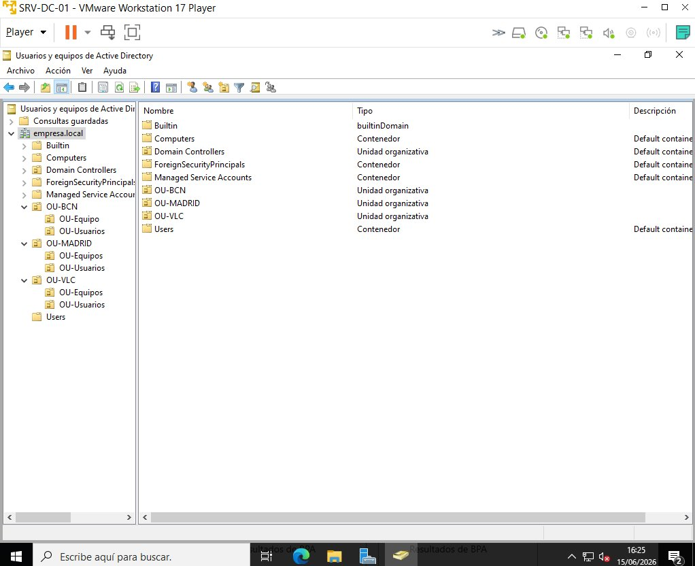

```
empresa.local
├── OU-MADRID
│   ├── OU-Equipos
│   ├── OU-Usuarios
│   │   ├── Jose Garcia Lopez     (josegalo)
│   │   └── Laura Martinez Ruiz   (lamaru)
│   ├── GRP-BaseDatos
│   ├── GRP-Redes
│   ├── GRP-Sistemas
│   └── GRP-Soporte
├── OU-BCN
│   ├── OU-Equipo
│   └── OU-Usuarios
│       ├── Alberto Gonzalez Gil  (agongil)
│       └── Ana Lopez Fernandez   (alofer)
└── OU-VLC
    ├── OU-Equipos
    └── OU-Usuarios
        ├── Miguel Torres Alba    (mitoral)
        └── Sofia Ramos Vega      (soramve)
```

### Usuarios en OU-MADRID

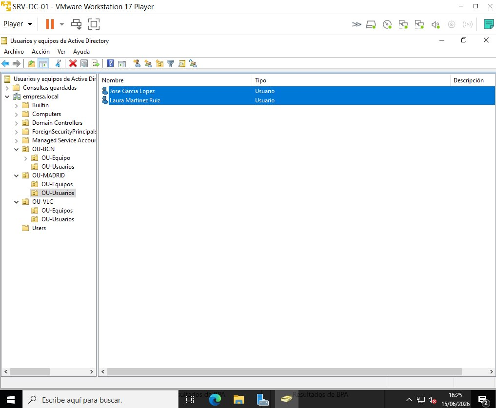

### Grupos de seguridad

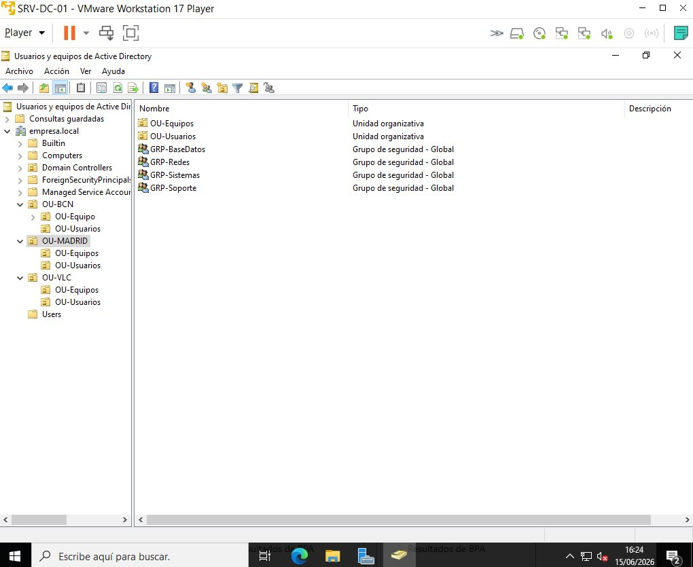

| Grupo | Tipo | Ámbito | Miembros |
|---|---|---|---|
| GRP-Sistemas | Seguridad | Global | jose.garcia |
| GRP-Redes | Seguridad | Global | laura.martinez, miguel.torres |
| GRP-Soporte | Seguridad | Global | alberto.gonzalez, sofia.ramos |
| GRP-BaseDatos | Seguridad | Global | ana.lopez |

---

## Políticas de grupo (GPOs)

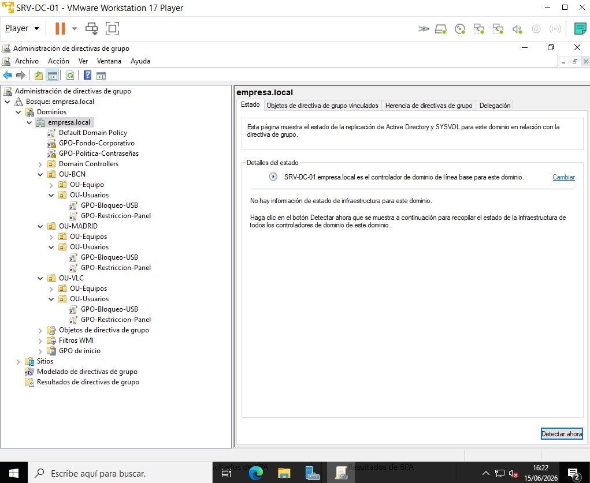

| GPO | Aplicada en | Tipo | Efecto |
|---|---|---|---|
| GPO-Fondo-Corporativo | empresa.local | Enforced | Fondo de escritorio corporativo |
| GPO-Politica-Contrasenas | empresa.local | Enforced | Longitud mínima 8 caracteres, complejidad activada |
| GPO-Restriccion-Panel | OU-Usuarios (3 sedes) | Vinculada | Deshabilita Panel de Control |
| GPO-Bloqueo-USB | OU-Usuarios (3 sedes) | Vinculada | Bloquea dispositivos de almacenamiento extraíble |

### GPO — Política de contraseñas

```
Computer Configuration → Policies → Windows Settings
→ Security Settings → Account Policies → Password Policy

Minimum password length:              8
Password must meet complexity:        Enabled
Maximum password age:                 90 days
Minimum password age:                 1 day
Enforce password history:             5 passwords
```

### GPO — Restricción Panel de Control

```
User Configuration → Policies → Administrative Templates
→ Control Panel
→ Prohibit access to Control Panel and PC Settings: Enabled
```

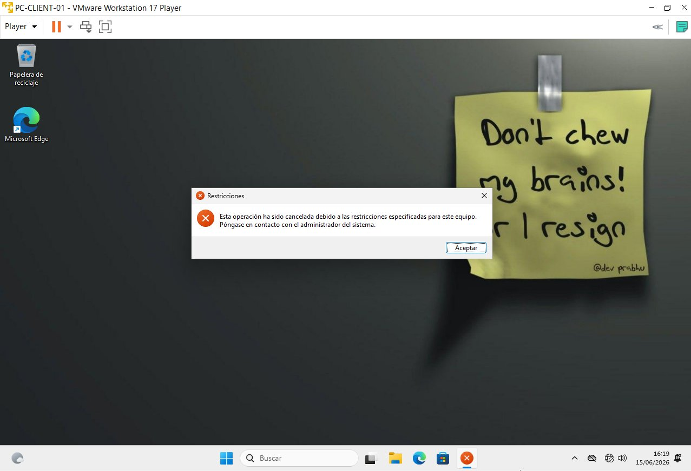

### GPO — Fondo corporativo

```
User Configuration → Preferences → Windows Settings → Registry

HKCU\Control Panel\Desktop
  Wallpaper     = C:\Windows\Web\Wallpaper\Corporativo\fondo.jpg
  WallpaperStyle = 10 (Fill)
```


### GPO — Bloqueo USB

```
Computer Configuration → Policies → Administrative Templates
→ System → Removable Storage Access
→ All Removable Storage classes: Deny all access: Enabled
```

---

## Verificación

### gpresult /r en PC-CLIENT-01

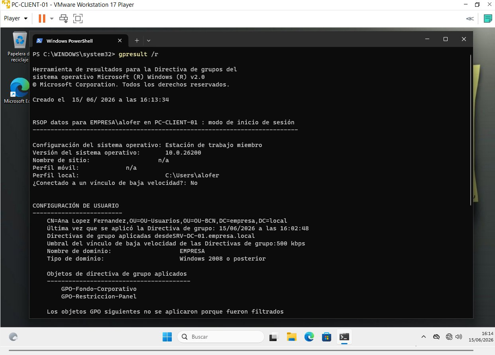
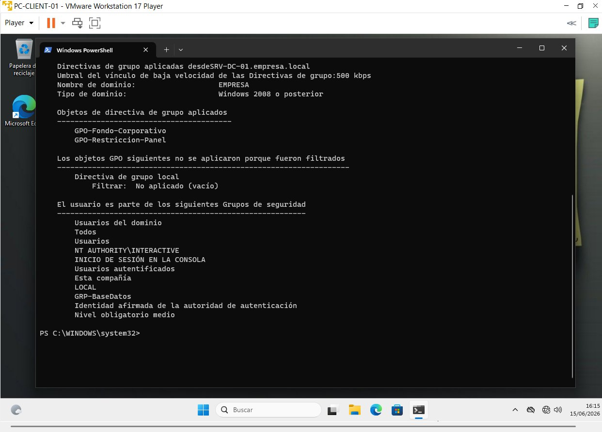

### Usuarios del dominio — Get-ADUser

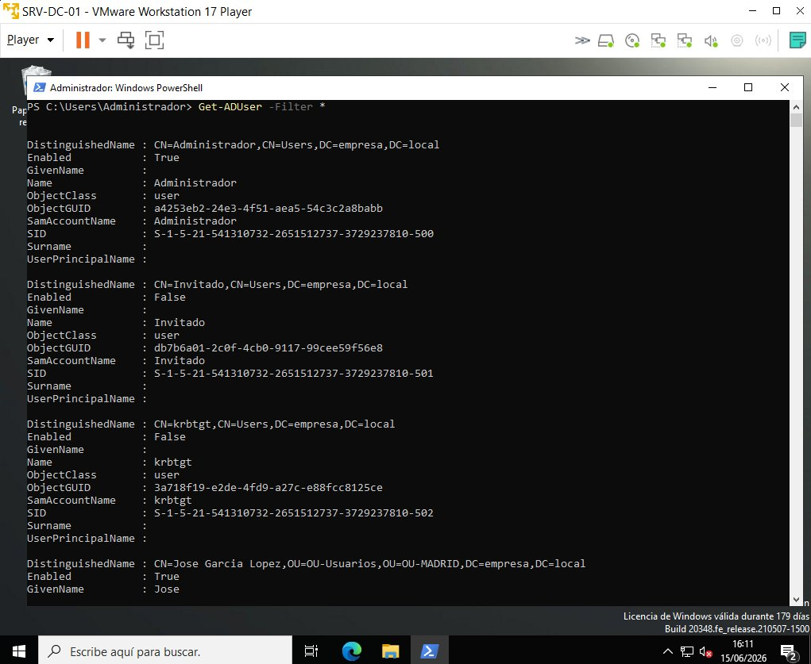
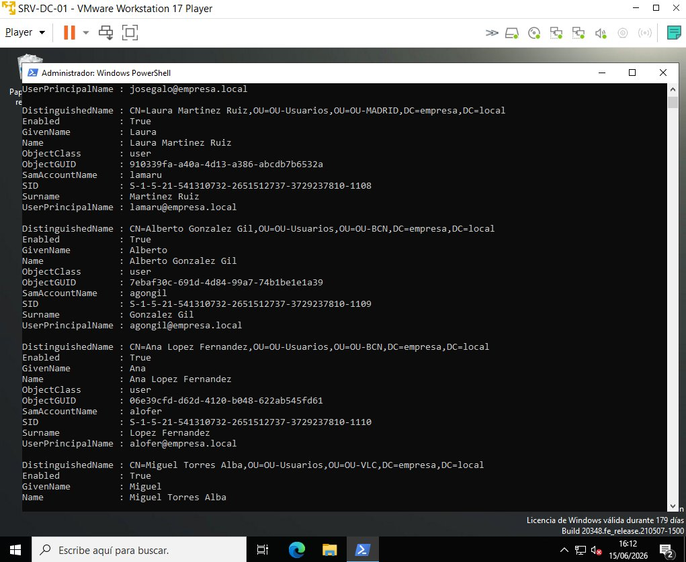

### Equipos del dominio — Get-ADComputer

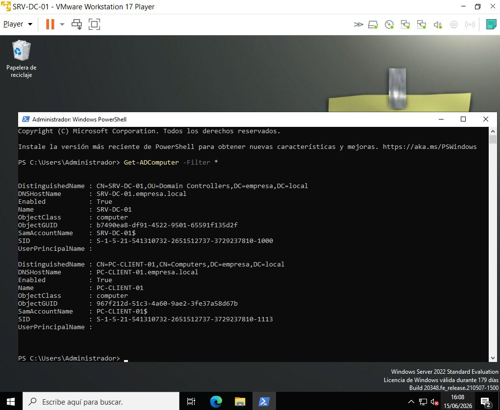

### Resultados esperados

| Prueba | Resultado |
|---|---|
| `Get-ADUser -Filter *` | 6 usuarios del dominio + cuentas del sistema |
| `Get-ADComputer -Filter *` | SRV-DC-01 y PC-CLIENT-01 |
| `gpresult /r` | GPO-Fondo-Corporativo y GPO-Restriccion-Panel aplicadas |
| Panel de Control | Bloqueado con mensaje de restricción |
| Fondo de escritorio | Imagen corporativa aplicada via GPO |
| `whoami` en cliente | EMPRESA\alofer |

---

## Problemas encontrados

**Problema:** El fondo de pantalla aparecía en negro en el cliente aunque la GPO estaba aplicada.
**Causa:** Windows 11 bloquea por seguridad los fondos servidos desde rutas de red (UNC paths) cuando se aplican via Administrative Templates.
**Solución:** Usar User Configuration → Preferences → Windows Settings → Registry para escribir directamente la clave `HKCU\Control Panel\Desktop\Wallpaper` con una ruta local copiada previamente al cliente via GPO Files.

---

**Problema:** La ruta del fondo estaba mal especificada en el registro.
**Causa:** Error tipográfico en la ruta al configurar la clave de registro en la GPO.
**Solución:** Verificar la ruta con `regedit` en el cliente navegando a `HKEY_CURRENT_USER\Control Panel\Desktop\Wallpaper` y corregirla en la GPO.

---

*Laboratorio realizado con VMware Workstation 17 Player — Daniel Moisés Loyo Vásquez*
